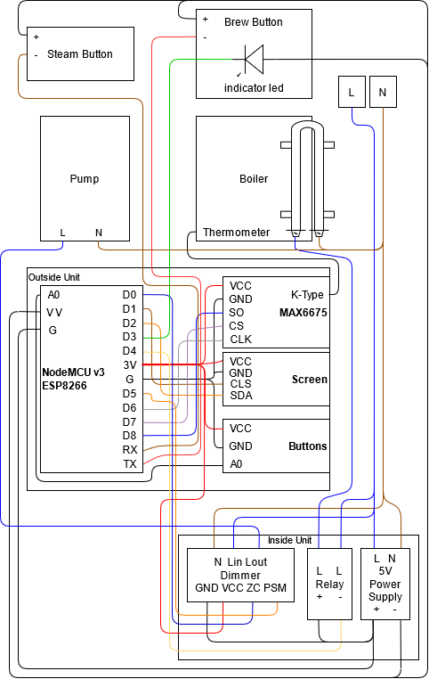

# Capulus - Yet another PID for coffee machines

# Features
 - PID - temperature control
 - Auto tune for PID - PID values can be tuned automatically 
 - Pressure control - controls pump with PWM dimmer
 - Indicator light - shows when the temp is ideal to start brewing
 - Preinfusion - ability to run pump in a different value for a period before brewing
 - Brew timers - precise control on brewing and preinfusion time, the pump automatically shut downs once the timer stops
 - Configurable - all values are configurable without needing another device
 - Persistance - all changes (including auto tuning) persist between power cycles
 - Sleep mode - if the machine is forgotten on, it shuts down automatically
 - Steam PID - separate temperature control options for steaming
 - Intuitive UI - the menu is displayed with big fonts and navigated with three buttons:
    - Minus - decreases/disables selected value
    - Option - moves cursor to next item
    - Plus - increases/enables selected value
 - Realtime graph - temperature graph and current status displayed while brewing
 - Quality of live improvements - ex: when steam is enabled the cursor moved to the steam temp automatically, current temperature displayed on temperature related elements in the menu
 - Safety - all 240v components lives inside the machine where they are out of touch. There is only 5v max coming outside of the machine.

# Software Architecture
The current implementation is separated as user input, state, user output and coffee machine. Input is read from buttons for now, a web UI/app can be implemented for this part. This input data is given to state to modify state data. State also handles with max/min limits, persistance and its planned to handle profiles as well. User output is currently only the display a web UI can be added in this step as well. Each section of the UI is represented with a function that takes input what to print. And the coffee machine part is implemented in main file to keep everything together and readable.

# Future Improvements
 - Profiles - different settings stored on device for different beans/water that can be changed easily
 - wifi/app/cloud support
 - unit tests and integration tests
 - better architecture for different parts in main.cpp (calibrate,input,temp control,display)
 - 3D printed boxes and mounting for two different parts. Inner parts consisting the relay, power source and dimmer. And outer parts consisting the controller, screen, buttons.
 - Circuit design for outside unit to make it more compact

# Circuits
I added used pin names based on NodeMCU v3 (esp8266) and I also added cable color for the external connections but of course that changes depending how you implement the circuit so the colors can be ignored. You can change the circuits and pins according to your needs. This page provides more information for which pins to use. Be careful about which ones cause a fail on boot: [thehookup's nodemcu pin document](https://github.com/thehookup/Wireless_MQTT_Doorbell/blob/master/GPIO_Limitations_ESP8266_NodeMCU.jpg) 

## Input buttons

There are 5 input buttons:
    - Minus - decreases/disables selected value
    - Option - moves cursor to next item
    - Plus - increases/enables selected value
    - Steam - the steaming button on the machine itself
    - Brew - the brewing and pump button on the machine itself
Three of these buttons (minus,option,plus) connected with analog input and voltage divider circuits. I use six 10k resistors to build the circiut but other values are also possible. Only thing required is to have different values for each button connection. Then MINUSVAL, OPTIONSVAL and PLUSVAL can be modified for the new resistor values. You can calculate it using the formulas in the input.buttons.cpp but best way to do it is by experimenting. You can build a simple code that reads analog input and prints and click on the buttons one by one to set their values. This is required since the components required by this project uses up all the pins on nodemcu v3. If you are using a board with more pins you can connect them directly with digital input and modify input.buttons.cpp accordingly.

This image resourced from [codebender_cc at instructables](https://www.instructables.com/How-to-Multiple-Buttons-on-1-Analog-Pin-Arduino-Tu/), you can also find more information about this button circuit design there.

If you want to build an enclosure for buttons and screen as well, please include back support for the buttons otherwise with the force applied the buttons can shift. You can see my crappy back support (two hot glued plastic sticks that reaches to the end of the box for support) in the picture:

## Dimmer Module and Relays
Heater is connected with a relay, I used SSR-40DA on D4 (pin 2).
Pump is connected with [robotdyn dimmer module](https://robotdyn.com/ac-light-dimmer-module-1-channel-3-3v-5v-logic-ac-50-60hz-220v-110v-1.html) on D5 (pin 14) for PWM and on D0 (pin 16) for zero-cross detection (z-c).

## Temp Sensor
I used a m4 threaded thermocouple with MAX6675. Its connected as follows:
SO: D8 (pin 15) 
CS: D7 (pin 13)
CLK: D6 (pin 12)
You can modify temp.sensor.h if you want to change the setup.
You can find more information on how to wire temp sensor and screen [here](https://www.14core.com/wiring-thermocouple-max6675-on-esp8266-12e-nodemcu/)

## Screen
I used a SSD1306 on D1 (pin 5) for CLS and D2 (pin 4) for SDA.
You can find more information on how to wire temp sensor and screen [here](https://www.14core.com/wiring-thermocouple-max6675-on-esp8266-12e-nodemcu/)

## Power Supply
I have used [this](https://www.aliexpress.com/item/32787568253.html?spm=a2g0s.9042311.0.0.7f184c4dnU5TtA) power supply since its cheap and compact. If you are not good with soldering I dont recommend this one since it requires to solder high voltage and low voltage cables.

# Enclosure
I have used [this](https://www.aliexpress.com/item/1005001598487212.html?spm=a2g0s.9042311.0.0.1c5e4c4dZsRFiI) hobby box and a dremel to build a box to hold all the electronic. If you are going to use the same method order multiple boxes to perfect your hand on using the dremel. You can prefer to only have the screen and buttons outside and keep everything mounted inside the machine as well, but this design allows modularity and development separated from the machine. I designed a mock coffee machines with three leds and two buttons to be able to test it. One led turns on if the heater is on, another one turns on if the pump is on and brightness changes thanks to PWM representing pump power. And the last led acts as the indicator led. The two buttons acts like the steam and brew button. The box I used was a bit small as well so I had to implement 90 degree angled short connectors to be able to keep everything modular. I cut off the plastic clip holding the plastic housing around the regular connectors, pull out the plastic housing and bend the pin. Then I cut the plastic housing to a quarter. And hot glued that to connector.

I really want to design a 3D printed box for this project, but I wanted to be able to build a prototype first to see what I need, and I was looking for excuses to use a dremel.

I also kept all high voltage components inside the machine (Relay, dimmer, power supply). I hot glued these components to the relay and mounted that with zip ties.